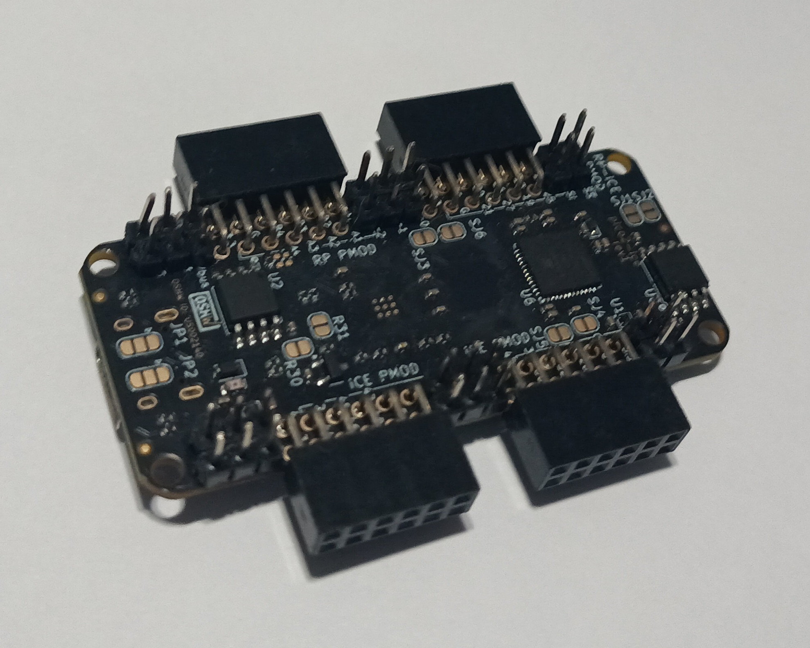

# Getting Started

Once you receive the board, you would be able to plug via USB and see the RGB LED blinking.
You might want to update the default firmware to make sure to have the latest bugfixes:

## Default Firmware

[source](https://github.com/tinyvision-ai-inc/pico-ice-micropython) -
[download](https://github.com/tinyvision-ai-inc/pico-ice-micropython/releases)

To provide the various USB programming methods and allow to boot the FPGA, a
default firmware is loaded onto the RP2350 (Pico part of the pico2-ice).

It provides:

- Micropython 1.24.1 or later accessible via USB CDC

- USB MSC to copy data to the Micropython filesystem

- A custom module to flash the FPGA flash or RAM

See [Programming the RP2350](md_programming__the__mcu.html) for how to load this firmware file.

## Soldering the Pmods

In case you ordered the board without the [Pmod](md_pmods.html) connectors soldered,
you would need to solder them in to plug something onto the board.
For instance like this:

## Inserting the Flex into the FPC connector

The high speed port from the RP2350 is connected to J6 which is quite a delicate connector. The FPC conenctor uses a Top Contact, Plunger style connector.

Please see [this guide](https://www.mouser.com/pdfdocs/ENG_DS_1-1773959-6-flexible-printed-circuit-con_1018.pdf) for details on how to connect to it safely without breaking the connector.

## Using the SDK

The [RP2350](https://www.raspberrypi.com/products/rp2350/) on the
pico2-ice can be programmed with either custom C firmware, or languages such as
[MicroPython](https://micropython.org/download/RPI_PICO2/),
[CircuitPython](https://circuitpython.org/board/raspberry_pi_pico2/),
[Go](https://tinygo.org/docs/reference/microcontrollers/pico2/),
[Rust](https://docs.rs/rp2-hal/latest/rp2_hal/),
[JavaScript](https://kalumajs.org/),
[ZeptoForth](https://github.com/tabemann/zeptoforth),
...

Currently C/C++ programming is best suported through the pico-ice-sdk, which is shared between pico-ice and pico2-ice:
a Raspberry Pi [pico-sdk](https://github.com/raspberrypi/pico-sdk/) library.

This is a guide for how to build application running on the RP2350 microcontroller.

The [pico-ice-sdk](https://github.com/tinyvision-ai-inc/pico-ice-sdk/tree/pico2-ice_develop) provides an API for communicating with the pico-ice hardware, also allowing to use the Raspberry Pi [pico-sdk](https://github.com/raspberrypi/pico-sdk/) directly.

The pico-ice-sdk is organised as a normal pico-sdk project with `pico2_ice` custom board.

The [examples](https://github.com/tinyvision-ai-inc/pico-ice-sdk/tree/pico2-ice_develop/examples) show how everything can be to get started.

Here is how to turn an example into a new project:

    # copy the whole example directory
    cp -r pico-ice-sdk/examples/pico_usb_uart my-new-pico-ice-firmware
    cd my-new-pico-ice-firmware

    # turn it into a git repository
    git init
    git remote add origin git@github.com:your-username/my-new-pico-ice-firmware

    # replace the two symlinks by git submodules
    rm pico-sdk pico-ice-sdk
    git submodule add https://github.com/raspberrypi/pico-sdk
    git submodule add https://github.com/tinyvision-ai-inc/pico-ice-sdk

    # fetch the submodules (using --recursive is very slow)
    git -C pico-ice-sdk submodule update --init
    git -C pico-sdk submodule update --init lib/tinyusb

    # you can now build it as a CMake project
    mkdir build && cd build
    cmake -DPICO_BOARD=pico2_ice .. && make

You can now edit the name of the project in the CMakeLists.txt, add new sources, and change the code.

## Troubleshooting

Feel free to join the [chat server](https://discord.gg/sb2kwc66) to ask for help.

### Error: C++ compiler not installed on this system

The pico-sdk is written in C, but uses a single C++ file to enable C++ support in the SDK.
This means you need a working C++ cross compiler, often named `arm-none-eabi-g++`.

Even if this binary is present in your system, it might not be a full C++ installation.
If you do not need C++ and want to work around this bug, you can disable the C++ support
in the pico-sdk. From your project repo:

    $ cd build
    $ cmake .. # download the SDK if not yet done
    $ sed -i '/new_delete.cpp/ d' _deps/pico-sdk-src/src/rp2_common/pico_standard_link/CMakeLists.txt
    $ cmake .. # rebuild the Makefile with the fix
