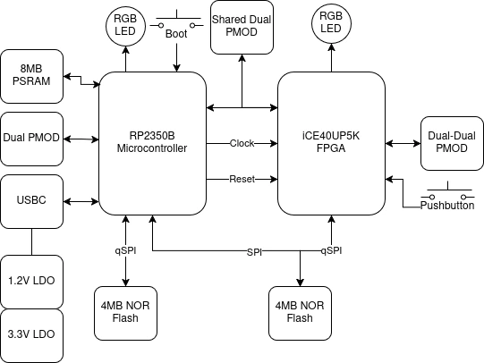

[Doc](http://pico2-ice.tinyvision.ai/)
| [Hardware](https://github.com/tinyvision-ai-inc/pico2-ice)
| [SDK](https://github.com/tinyvision-ai-inc/pico-ice-sdk)
| [Schematic](https://raw.githubusercontent.com/tinyvision-ai-inc/pico2-ice/docs/Board/Rev1/pico2-ice.pdf)
| [Assembly](https://htmlpreview.github.io/?https://github.com/tinyvision-ai-inc/pico2-ice/blob/docs/Board/Rev1/bom/pico2-ice_ibom.html)
| [Discord](https://discord.gg/t2CzbAYeD2)

The pico2-ice is a small, low cost board with the Raspberry Pi Pico processor ([RP2350](https://www.raspberrypi.com/documentation/microcontrollers/silicon.html#rp2350)) and a Lattice Semiconductor [iCE40UP5K](https://www.latticesemi.com/en/Products/FPGAandCPLD/iCE40UltraPlus) FPGA. The board features independent flash for the FPGA and RP2350, low power PSRAM, a couple of pushbuttons and a two 3 color LED with _all_ FPGA and RP2350 pins brought out to easy to use 0.1" header pins (arranged as Pmod's) for fast prototyping.

Board Hardware Features:

* Raspberry Pi RP2350B processor
* Lattice UltraPlus ICE40UP5K FPGA with 5.3k LUTs, 1Mb SPRAM, 120Kb DPRAM, 8 Multipliers
* _ALL_ RP2350 and 32 FPGA GPIO on 0.1” headers
* 4MB SPI Flash
* 8MB low power qSPI SRAM
* 2 RGB LED, one for the RP2350 and one for the FPGA
* 2 pushbuttons, 1 for RP2350 boot mode that can also be used for other functions, and one for the FPGA
* On board 3.3V and 1.2V Regulators, can supply 3.3V to your project
* Open source schematic and layout using KiCAD design tools
* 4 layer board with a solid ground plane for good signal integrity

Board Firmware features:

* FPGA clock supplied by the RP2350, easy to program FPGA clock under SW control
* RP2350 can program the FPGA in various ways

