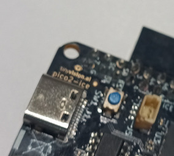

# Programming the RP2350

To upload a new firmware image on the RP2350 (the "pico" part of "pico2-ice"), you need to switch to that RP2350 UF2 bootloader mode instead of the FPGA UF2 mode.

You can do that by connecting a jumper between the `BT` pin a `Gnd` pin or hold the SW1 button, then toggle power:

1. Connect the `BT` pin to ground or hold the SW1 button. For instance with a pair of tweezers, a jumper, or an uncoated paper clip.

2. Toggle power to the RP2350, for example by unplugging and re-plugging the USB cable.

3. Disconnect the `BT` pin from ground.

4. Look for an USB drive named `RP2350` and mount it, open it, and check that there are only 2 files in it: `INFO.HTML` and `INFO_UF2.TXT`.

5. Copy the `.uf2` firmware file onto the USB drive.

6. Eject the USB drive.
   At this step, the firmware should be uploaded and running.

Since version [`v1.6.1`](https://github.com/tinyvision-ai-inc/pico-ice/releases),
it is possible to reboot the pico2-ice into bootloader "BOOTSEL" mode without jumpers:

    picocom --baud 1200 /dev/ttyACM0

This uses the [convention established by Arduino boards](https://arduino.github.io/arduino-cli/dev/platform-specification/#1200-bps-bootloader-reset)
which reset into bootloader mode when connecting with baud 1200.

After this, it becomes possible to use the [picotool](https://github.com/raspberrypi/picotool) to control the firmware (upload, check version, reboot):

    $ sudo picotool info
    Program Information
     name:      pico_ice_default
     features:  USB stdin / stdout

## Troubleshooting

### RPI-RP2 is still visible after step 6

This means the device remained in "bootloader" mode.
One thing to check is that the `BT` pin is not connected to anything anymore,
then try to reset the board.
